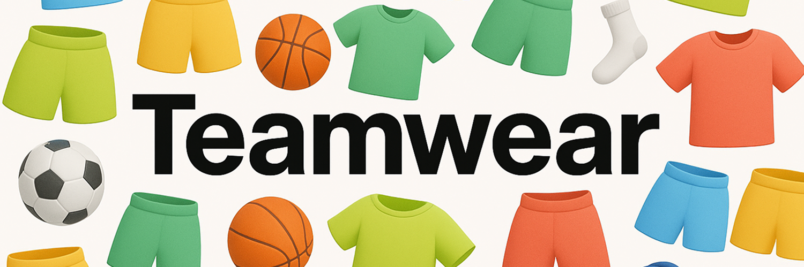

    

 

    
    
</a>

 

<strong>Teamwear</strong>

 Customizable assets for sports teams.

 

<a href="https://">Prod</a> 
 · 
<a href="https://">Jira</a>
 · 
<a href="https://">Wiki</a>

 

## 🍰 Stack

- Language: [Typescript](https://www.typescriptlang.org/docs/)
- Framework: [Next.js](https://nextjs.org/docs)
- Styling: [Tailwind](https://tailwindcss.com/docs/styling-with-utility-classes)

**Tooling**
- Lint/Format: [Biome](https://biomejs.dev/formatter/)
- Variable env: [Dotenvx](https://dotenvx.com/)
- Git Hooks: [Husky](https://typicode.github.io/husky/how-to.html)
- Git Lint: [Commit Lint](https://commitlint.js.org/guides/getting-started.html)

## 🚀 Get started

1. Ask the `.env.keys` [to the team](https://mail.google.com/mail/u/0/#chat/space/AAQACPYdmps) and place it at the root directory
2. Run `pnpm install` to install dependencies
3. Open [https://localhost:3000](https://localhost:3000)

## 🤝 How to contribute

1. Choose a Jira in [the active sprint](https://decathlon.atlassian.net/jira/software/c/projects/ODVC/boards/5582)
2. Create a git branch following the Jira snippet
3. Commit...
4. Create a [GitHub PR](https://github.com/dktunited/teamwear/pulls)
5. Assign someone or an AI to review
6. Merge your branch to main
7. Delete your remote/local branch

**Some more advice:**
- Less is more
- Ask for help when needed
- Do pair programming to learn/educate
- Write down important decisions under `docs/`

## 📦 How to deploy

### Preview 

When you [create a GitHub PR][createpr], a preview environment with a unique URL is created to show/share your change.  
When you merge a GitHub PR, your preview environment is automatically deleted.

[createpr]: https://github.com/dktunited/teamwear/compare

### Production

When you [create a GitHub Release][createrelease], a new version is deployed on production. 

[createrelease]: https://github.com/dktunited/teamwear/releases/new

## 📝 Copyright

© Decathlon - All rights reserved.